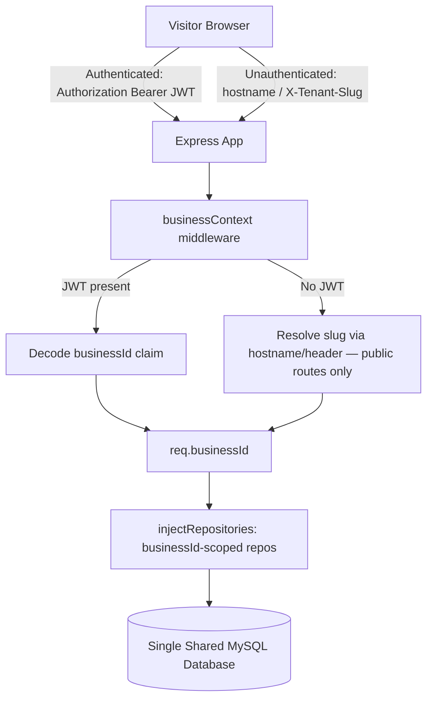
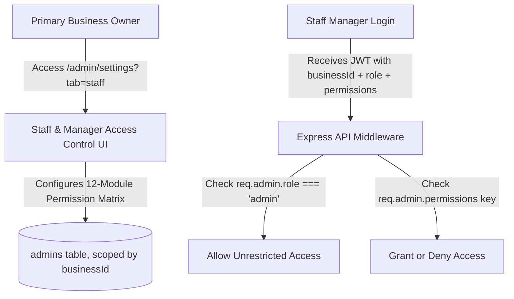

# Shared-Database, JWT-Derived Business Tenancy

This document explains how this application scopes data to a specific business (tenant) and how routing/authentication work together to keep every business's data isolated.

> This replaces the prior per-tenant-database, subdomain-routed architecture. The authoritative source of truth is [`.specify/memory/constitution.md`](.specify/memory/constitution.md) (Principle I) and [`specs/001-shared-db-business-tenancy/`](specs/001-shared-db-business-tenancy/) — this document is a narrative walkthrough, not the spec itself.

---

## 🏗️ High-Level Request Flow



---

## 📡 1. Tenant/Business Resolution

There is exactly **one** mechanism that establishes `req.businessId` for the rest of the request: `server/src/middlewares/businessContext.js`.

1. **`Authorization: Bearer <jwt>` present** — this is every route reachable after login. The JWT's `businessId` claim is the sole source of truth. Hostname, `X-Tenant-Slug`, and `?tenant=` are never consulted once a token is present.
2. **No token present** — this is the login endpoints and the public, unauthenticated storefront (branding/availability lookup for an anonymous visitor). The business is resolved from the request hostname's subdomain (production) or the `X-Tenant-Slug` header / `?tenant=` query param (local dev, matching the old dev-fallback behavior).

A token issued under the old scheme (carrying `tenant: <slug>`, no `businessId` claim) is rejected outright — the holder must log in again.

```js
// server/src/middlewares/businessContext.js (simplified)
if (bearerTokenPresent) {
  const decoded = jwt.verify(token, JWT_SECRET);
  if (!decoded.businessId) return res.status(401).json(...); // old-shape token
  req.businessId = decoded.businessId;
} else {
  const slug = extractSlugFromHostnameOrHeader(req);
  const business = await Business.findOne({ where: { slug, isActive: true } });
  req.businessId = business.id;
}
```

---

## 🔌 2. The Database Layer (Single Shared Database)

There is one MySQL database for the whole service (`server/src/config/db.js`). Every business-owned table — `bookings`, `grounds`, `slots`, `admins`, `finance_entries`, etc. — carries a required `businessId` column with a `RESTRICT` foreign key to `businesses.id`. The `businesses` table (`server/src/models/Business.js`) replaces the old master-DB `Tenant` registry as an ordinary table in this same database.

### Scoped Repositories

Controllers never write a `businessId` filter by hand. `server/src/repositories/scope.js`'s `withBusinessScope()` wraps every repository method (`server/src/repositories/repository-factory.js`) so that:

- Every `find*`/`count*`/`sum*`/`get*` call has `{ businessId }` merged into its `where` clause, **and** its result is independently checked to actually belong to that business before being returned (defense in depth — a second, independent guarantee beyond the query filter).
- Every `create*` call has `{ businessId }` merged into the data being inserted.

```js
// server/src/middlewares/injectRepositories.js
req.repos = withBusinessScope(createRepositories(models), req.businessId);
```

### Identifier Guard

`server/src/middlewares/identityGuard.js` rejects (`400`) any `POST`/`PUT`/`PATCH` request body containing `businessId`, `tenantId`, `adminId`, or `userId` — these are never client-suppliable, only ever derived server-side from the JWT.

### Cross-Business FK Validation

Where one business-owned record references another (e.g. a `Booking`'s `groundId`), the referenced row is looked up through the same business-scoped repository before being accepted — a `groundId` belonging to a different business simply won't be found, and the write is rejected `400`.

---

## 🔑 3. Session Isolation & JWT Claims

| | Before | Now |
|---|---|---|
| Admin/manager login | `{ id, tenant: <slug>, type: 'admin' }` | `{ id, businessId, type: 'admin' }` |
| Customer OTP login | `{ id, tenant: <slug>, type: 'user' }` | `{ id, businessId, type: 'user' }` |
| Replay check | `decoded.tenant === req.tenant.slug` | `decoded.businessId === req.businessId` |

`protect`/`protectUser` middleware (`server/src/middlewares/auth.js`) consume the identity already decoded by `businessContext`, then look up the admin/user via the business-scoped repositories.

---

## 🚀 4. Provisioning a New Business (Super Admin)

Provisioning no longer creates a physical database. `POST /api/master/tenants` (`server/src/controllers/tenant.controller.js`) now:

1. Creates one `Business` row in the shared database.
2. Creates that business's first `Admin` row (`businessId` set to the new business).
3. Creates default `Settings` for the business.
4. Records initial `SubscriptionHistory`.

No `CREATE DATABASE`, no per-tenant schema sync — the new business is immediately usable.

---

## 🛡️ 5. Role-Based Access Control (RBAC) & Multi-Manager Security

Unchanged in behavior from the prior architecture, and preserved as a strength of this product relative to its sibling repos in this workspace (`business_backend`, `restaurant_backend` have no equivalent RBAC layer):



Every `Admin` row (including managers) is itself scoped by `businessId` — a manager account created under one business can never authenticate against or act on another business's data, regardless of role or permission grants (verified in `server/tests/tenant-isolation.test.js`).

### RBAC Authorization Rules

1. **Primary Business Owner (`role = 'admin'`)**: unrestricted access across all admin portal modules for their own business; only they can manage staff accounts.
2. **Staff Manager (`role = 'manager'`)**: restricted to the specific feature keys toggled by the primary admin (`bookings`, `calendar`, `finances`, `slots`, `grounds`, `requests`, `blacklist`, `reviews`, `messages`, `gallery`, `settings`, `auditLogs`); enforced server-side by `requirePermission(permissionKey)`.

---

## 📖 Migrating Existing Production Data

If you are cutting an existing deployment over from the old per-tenant-database architecture, see `specs/001-shared-db-business-tenancy/quickstart.md` and the migration/backfill scripts under `server/migrations/` and `server/scripts/` — this is a live-data operation and must be run deliberately, not inferred from this document.
