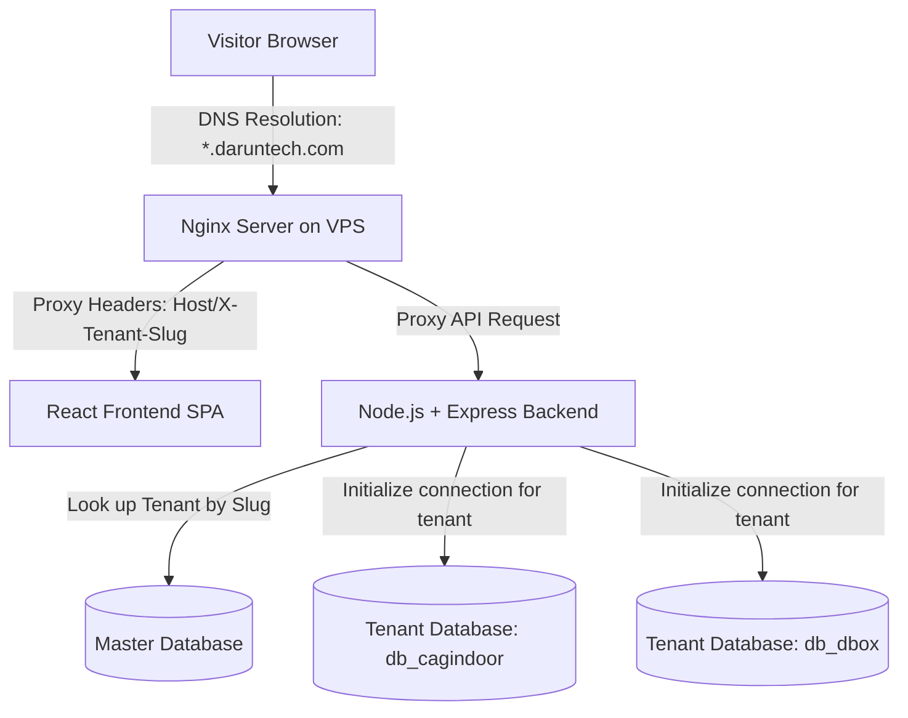

# Subdomain Routing & Multi-Tenant Architecture

This document provides a detailed technical explanation of how wildcard subdomains work in this application, and how it handles routing and database isolation for multiple businesses.

---

## 🛠️ High-Level Request Flow

When a user visits a custom subdomain on your platform, the request travels through three main layers:



---

## 📡 1. The DNS Layer (Domain Name System)
To support dynamic client subdomains (e.g., `dbox.daruntech.com`, `cagindoor.daruntech.com`, `anyname.daruntech.com`) without adding new server configurations for each client, we use **Wildcard DNS**.

* **DNS Configuration**:
  * **Record Type**: `A`
  * **Host**: `*` (asterisk acts as a wildcard match for any subdomain)
  * **Value / IP**: `YOUR_VPS_IP` (e.g. `123.45.67.89`)
  * **TTL**: `3600` (1 hour)

Any request matching `*.daruntech.com` is automatically resolved and routed by DNS servers to your VPS server.

---

## ⚙️ 2. The Nginx Layer (Web Server & Proxy)
Once traffic arrives at the VPS, Nginx intercepts the HTTP request. We configure Nginx using a regular expression server name rule inside `client/nginx.conf` or a global Nginx block:

```nginx
server {
    listen 80;
    server_name ~^(?<tenantSlug>.+)\.daruntech\.com$;

    # 1. Serve React Frontend SPA
    location / {
        root /usr/share/nginx/html;
        try_files $uri /index.html;
    }

    # 2. Proxy API requests to Node Server
    location /api/ {
        proxy_pass http://server:5000;
        proxy_set_header Host $host;
        proxy_set_header X-Real-IP $remote_addr;
        proxy_set_header X-Forwarded-For $proxy_add_x_forwarded_for;
        proxy_set_header X-Tenant-Slug $tenantSlug; # Forward slug explicitly to backend
    }
}
```

* Nginx extracts the subdomain slug (e.g. `cagindoor` from `cagindoor.daruntech.com`) and puts it into the variables.
* It forwards the request to our backend server, injecting the `X-Tenant-Slug` header so the API server knows which tenant is making the request.

---

## ⚛️ 3. The React Frontend Layer
The React Single Page Application (SPA) is dynamically customized based on the active URL:

1. **Subdomain Identification**: On initial mount, React evaluates the hostname:
   ```javascript
   // client/src/services/api.js
   export const getTenantSlug = () => {
     const hostname = window.location.hostname;
     const parts = hostname.split('.');
     if (parts.length >= 3) {
       return parts[0]; // Returns "cagindoor" from cagindoor.daruntech.com
     }
     // Local development fallback (?tenant=cagindoor or header injection)
     return new URLSearchParams(window.location.search).get('tenant') || 'dbox';
   };
   ```
2. **Dynamic UI/Settings Rendering**:
   React requests public parameters using `/api/v1/info` with the tenant slug attached. The backend returns customized parameters (Business Name, Colors, Hero Banner media type, logo url).
   * React caches these settings in `localStorage` to prevent layout flashing.
   * If a user visits `cagindoor.daruntech.com`, they see the Cage logo and Futsal courts.
   * If a user visits `dbox.daruntech.com`, they see the D-Box branding and Cricket net options.

---

## 🔌 4. The Backend Layer (Database Isolation)
The backend routes database queries to isolated containers per business using a Master/Tenant pattern.

### The Master Schema (`indoor_master_db`)
Maintains a registry of all active tenants, subscription timelines, and SMS credentials.
```sql
CREATE TABLE Tenants (
  id INT AUTO_INCREMENT PRIMARY KEY,
  businessName VARCHAR(255) NOT NULL,
  slug VARCHAR(255) UNIQUE NOT NULL, -- e.g. "cagindoor"
  dbName VARCHAR(255) UNIQUE NOT NULL, -- e.g. "db_cagindoor"
  isActive BOOLEAN DEFAULT TRUE,
  subscriptionExpiresAt DATETIME,
  smsCredentials JSON
);
```

### Request Context Switcher Middleware (tenantMiddleware)
For every incoming API call:
1. **Extract Slug**: The backend reads the subdomain (or the fallback header `X-Tenant-Slug`).
2. **Registry Check**: Looks up the tenant database registry inside the master schema.
   * If not found or `isActive = false`, it returns `404 Tenant Not Found`.
   * If the current system time is past `subscriptionExpiresAt`, it returns `403 Tenant Suspended (Subscription Expired)`.
3. **Sequelize Connection Injection**: It requests a cached database connection for `dbName` or opens a new one using a dynamic connection manager.
4. **Instantiate Repositories**: The server binds models to the connection and attaches them to `req.repos` and `req.models`.
   ```javascript
   // Controllers simply use the injected models
   const bookings = await req.repos.bookingRepo.findAll();
   ```
   This ensures that no code queries data from another business.

---

## 🚀 5. How It Works When Creating a New Client

When a new business owner signs up and gets provisioned in the Super Admin dashboard:

1. **Information Seeding**: Super Admin fills in the form: Business Name `Apex Arena` and subdomain `apexarena`.
2. **Master Registry Write**: Super Admin inserts client info into the master database:
   ```json
   {
     "businessName": "Apex Arena",
     "slug": "apexarena",
     "dbName": "db_apexarena"
   }
   ```
3. **Database Creation Query**: The Express backend issues an admin DDL command:
   ```sql
   CREATE DATABASE db_apexarena;
   ```
4. **Table Migrations & Compilation**: The connection pool initializes `db_apexarena` and runs the schema compiler (`models.syncDatabase()`), creating all relational tables (`Bookings`, `Users`, `Slots`, `Settings`, `StatusHistories`, `AuditLogs`, `Grounds`, `FinanceCategories`, `FinanceEntries`). Auto-migrations ensure schema column additions (such as `discounts` and `maintenanceMode` JSON on `Settings`, `groundId` on `Bookings`, or `groundId` on `FinanceEntries`) apply seamlessly without manual DB interventions.
5. **Initial Seeding**: The system automatically inserts standard shifts pricing, provisions active playing courts, initializes discount rule lists, provisions their custom tenant admin credentials (`admin` / `adminpassword123`), and uploads default placeholders.
6. **Website Ready**: The business site is immediately active. Visiting `apexarena.daruntech.com` connects dynamically to the fresh database.

---

## 🛡️ 6. Role-Based Access Control (RBAC) & Multi-Manager Security

The platform supports **Multi-Manager Accounts** per tenant space with granular feature restriction middleware:

```mermaid
graph TD
    A[Primary Tenant Owner] -->|Access /admin/settings?tab=staff| B[Staff & Manager Access Control UI]
    B -->|Configures 12-Module Permission Matrix| C[(admins Table in Tenant Database)]
    D[Staff Manager Login] -->|Receives JWT with role & permissions| E[Express API Middleware]
    E -->|Check req.admin.role === 'admin'| F[Allow Unrestricted Access]
    E -->|Check req.admin.permissions[key]| G[Grant or Deny Access]
```

### RBAC Authorization Rules:
1. **Primary Business Owner (`role = 'admin'`)**:
   - Holds full unrestricted access across all admin portal modules.
   - Primary owner credentials (`username`, `password`) are protected against accidental lockouts/edits inside the staff menu.
   - Only the primary owner can access `/api/v1/auth/staff` to create, edit, or delete manager accounts.
2. **Staff Manager (`role = 'manager'`)**:
   - Access is restricted to the specific feature keys toggled by the primary admin (`bookings`, `calendar`, `finances`, `slots`, `grounds`, `requests`, `blacklist`, `reviews`, `messages`, `gallery`, `settings`, `auditLogs`).
   - UI navigation tabs filter dynamically based on `user.permissions` in `AdminLayout.jsx`.
   - Middleware `requirePermission(permissionKey)` enforces permissions on the backend, returning `403 Forbidden` if an unauthorized API call is attempted.

